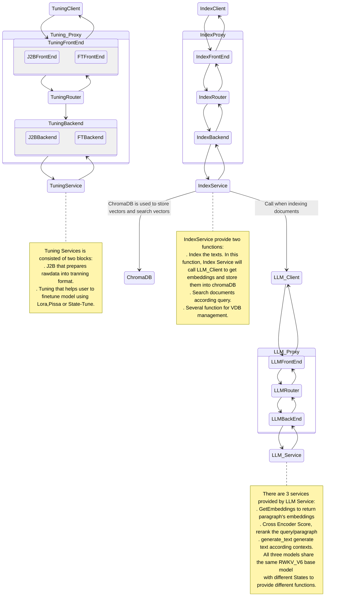

# RAG in one click 

This is an one click RAG system for RWKV named "AIIRWKV". AIIRWKV employed asynchronus processing, which allows maintainence and update of services to be done independently. This system design enables minimal encapsulation with high extensibility. 
Moreover, AIIRWKV has integrated one-click tools for StateTune, an extremely efficient fine-tuning method exclusive to RWKV. Additionally, it supports Lora and Pissa, providing convenient PEFT (Parameter-Efficient Fine-Tuning) solutions for users to tackle various downstream tasks.  


# System design

Even the minimal RAG system involves several sub-systems and these systems may interact with each other. In order to increase the development flexibility and flat the development curve, a queue based RAG system is designed.

Every component must be pluggable and easy to scale. Which means RPC shouldn't be hard-wired means like TCP/InProc/InterProcess, etc.

The best design pattern is a pub-sub model that every component connects to a broker(or proxy) to send requests and receive responses. Generally heavy weight message queue like RabbitMQ, RocketMQ is used to ensure efficiency and reliability. However a Message Queue service is still another monster to administrate and maintain. 

Here the new design is to use a broker free queue library ZeroMQ  as a queue service. 

Thanks to ZeroMQ's reliable and high performence implementation, this framework can scale from single resource restricted node to multinodes huge system.

RWKV_RAG system looks like:




## Download Models

* Please download baseline models from https://huggingface.co/BlinkDL
* Please download state for chatbot from: https://huggingface.co/SupYumm/rwkv6_7b_qabot/tree/main
* There are several options for embedding models and rerank models:
* Please download RWKV embedding model from :https://huggingface.co/yueyulin/rwkv6_emb_4k_base
* Please download BGEM3 embedding models from: https://huggingface.co/BAAI/bge-m3
* Please download BGEM3 reranker from: https://huggingface.co/BAAI/bge-reranker-v2-m3

Please feel free to chang your own embedding an reranker from config,yaml. Currently, BGEM3 is an ideal option; however, RWKV embedding models and reranker with better performance is coming soon.


The following part will describe the implementation which will update in the future since more features will be added. However the basic design will keep the same.


# Qick Start

## Requirement

Please Install the dependecies in the requirement.txt:
```shell
pip install -r requirement.txt 
```
The following is the recommendation of VRAM for RWKVs in diffrent parameters:
| SIZE | VRAM |
|----------|----------|
| 1.6b   | 4G   |
| 3b   | 7.5G   |
| 7b   | 18G |
|12b   | 24G|
|14b |30G|


## Modifying Configuration
You can control the activation or deactivation of all services through the configuration file ```ragq.yml```. By default, all services are enabled. Before use, you need to modify the following configuration items for some services.

### LLM Service
Embedding, reranking, and generating text.
- base_model_file: RWKV baseline models path， Refer to [RWKV基模下载](https://rwkv.cn/RWKV-Fine-Tuning/Introduction#%E4%B8%8B%E8%BD%BD%E5%9F%BA%E5%BA%95-rwkv-%E6%A8%A1%E5%9E%8B) or Download Models Above
 - bgem3_path: Embedding model path，Recommend:bge-m31
 - rerank_path: Rerank model path，Recommend:BAAIbge-reranker-v2-m3
 - state_path: state path;state is generated by state-tuning

### Index Service
- chroma_db_path: ChromaDB
- chroma_port: ChromaDB port
- chroma_host: ChromaDB host IP
- sqlite_db_path: sqlight db path

### Tuning Service

The default value can be used for rwkv6_1.6b.

## Start Services
```shell
python3 service.py 
```

## Start Client
```shell
streamlit run client.py
```
Open the url that provided by streamlit in the browser,you will see the flowing interface.

### Knowledge Base Interface


## Notes
- It is recommended to use Python 3.10 or Python 3.9.
- PyTorch Lightning must use version 1.9.5.
- The current version, when using the fine-tuning feature, will load the baseline model again, so it is necessary to allocate GPU memory reasonably to avoid errors due to insufficient VRAM.

# Hankbooks:

## Manage Vector Database:

This UI supports VDB Collection search，collection creation and deletion, content management of collection.

## Building knowledgebase

This UI supports three different methods to Index contents into knowledgebase: Hand-typing, uploading from local computer, upload from local server.
AIIRWKV also supports internet search to index real-time data from internet into knowledgebase. 
User can choose chunk size and chunk overlap on their own according to vairous situation.

## Fine-Tune RWKV models in one click:

### WanDB
Please register WanDB to monitor the status, especailly loss curve, of fine-tuning process.
A task bar that tracks fine-tuning process is displayed at backend terminal.

### Setting-up fine-tune Parameters:

VRAM requirement for fine-tuning RWKV models with 1024 ctx.

| Size      | fp16       | int8       | nf4       |
|---------------|------------|------------|-----------|
| RWKV6-1.6B    | 5.8GB GPU  | 4.5GB GPU  | 3.9GB GPU |
| RWKV6-3B      | 8.7GB GPU  | 6.2GB GPU  | 4.9GB GPU |
| RWKV6-7B      | 17.8GB GPU | 11.9GB GPU | 8.5GB GPU |

For detail explaintions of other parameters and hyperparameters, please refer to the official tutorial at : https://rwkv.cn/RWKV-Fine-Tuning/State-Tuning

## RAG CHATBOT

Please retrieve the most relevant information from the knowledgebase, then ask questions regarding those information. 
User can modify the basemodel and state dynamically on the UI.
AIIRWKV is a chatbot that can deliever precise answers based on all the information from last 6 round of conversation.
User can always change states for different downstream tasks.

# Futrue Direction

The multi-modal framework, primarily focused on ASR and Vision, will be available online soon. Additionally, GraphRAG and prompt optimization are also forthcoming.

# Acknowledgement
- All RWKV tuning service is adapted from [J.L](https://github.com/JL-er/RWKV-PEFT)
- All RWKV models is from [BlinkDL](https://github.com/BlinkDL/RWKV-LM)
- Authors: [YYnil](https://github.com/yynil) ; [Ojiyum](https://github.com/Ojiyumm) ;  [LonghuaLiu](https://github.com/Liu3420175)
