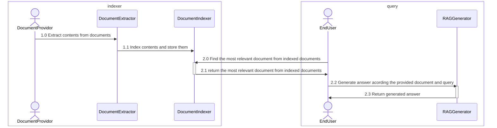
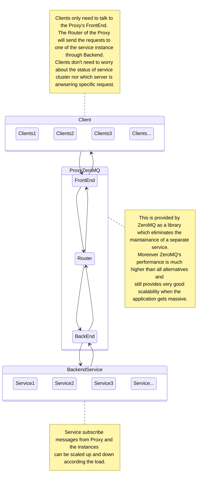
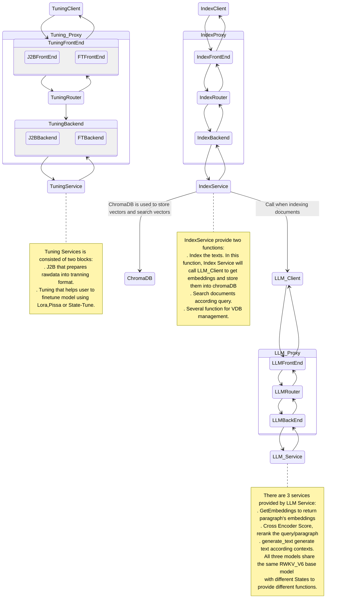

# All in one RAG system

This is an all in RAG system for RWKV named "AIIRWKV". AIIRWKV employed asynchronus processing, which allows maintainence and update of services to be done independently. This system design enables minimal encapsulation with high extensibility. 
Moreover, AIIRWKV has integrated one-click tools for StateTune, an extremely efficient fine-tuning method exclusive to RWKV. Additionally, it supports Lora and Pissa, providing convenient PEFT (Parameter-Efficient Fine-Tuning) solutions for users to tackle various downstream tasks.  

A RAG system consists of several parts, in general there are following minimal parts:
 
 - documents extracter:
 
    This part is to ingest documents from either local harddrives or search results from internet. It will extract data from different formats' original documents, segment the data into chunks which can be indexed by the document indexer.

 - document indexer:

    This part is to use the vector database and/or traditional search engine to index the data extracted by documents extracter. Then it will provide services to search indexed documents according user input query.

 - Retreival Augmented Q/A generator:

    This part is responsible for generating retrieval-augmented question and answer pairs based on the document found by document indexer. It ususally utilize LLM to generate reasonable answer.

# System design

Even the minimal RAG system involves several sub-systems and these systems may interact with each other. In order to increase the development flexibility and flat the development curve, a queue based RAG system is designed below:



Every component must be pluggable and easy to scale. Which means RPC shouldn't be hard-wired means like TCP/InProc/InterProcess, etc.

The best design pattern is a pub-sub model that every component connects to a broker(or proxy) to send requests and receive responses. Generally heavy weight message queue like RabbitMQ, RocketMQ is used to ensure efficiency and reliability. However a Message Queue service is still another monster to administrate and maintain. 

Here the new design is to use a broker free queue library ZeroMQ  as a queue service. 

Thanks to ZeroMQ's reliable and high performence implementation, this framework can scale from single resource restricted node to multinodes huge system.

The new design looks like:


Every component must be pluggable and easy to scale. Which means RPC shouldn't be hard-wired means like TCP/InProc/InterProcess, etc.

The best design pattern is a pub-sub model that every component connects to a broker(or proxy) to send requests and receive responses. Generally heavy weight message queue like RabbitMQ, RocketMQ is used to ensure efficiency and reliability. However a Message Queue service is still another monster to administrate and maintain. 

Here the new design is to use a broker free queue library ZeroMQ  as a queue service. 

Thanks to ZeroMQ's reliable and high performence implementation, this framework can scale from single resource restricted node to multinodes huge system.

The new design looks like:


# Details of implementation

## Download Models

* Please download baseline models from https://huggingface.co/BlinkDL
* Please download state for chatbot from: https://huggingface.co/SupYumm/rwkv6_7b_qabot/tree/main
* There are several options for embedding models and rerank models:
* Please download RWKV embedding model from :https://huggingface.co/yueyulin/rwkv6_emb_4k_base
* Please download BGEM3 embedding models from: https://huggingface.co/BAAI/bge-m3
* Please download BGEM3 reranker from: https://huggingface.co/BAAI/bge-reranker-v2-m3

Please feel free to chang your own embedding an reranker from config,yaml. Currently, BGEM3 is an ideal option; however, RWKV embedding models and reranker with better performance is coming soon.


The following part will describe the implementation which will update in the future since more features will be added. However the basic design will keep the same.

## Service starter

The service starter(src/services/service_starter.py) is the entry to start all backend services. This script will use a yaml configuration file. By default it's using resouces/service.yml. 

Currently three services are implemented:



# Qick Start

## 修改配置文件
可通过配置文件ragq.yml来控制各个服务的开启或者关闭，默认全部开启。在使用前，需要修改以下服务的一些配置项

### LLM Service
LLM服务，主要用来做Embedding, rerank和生成文本
 - base_model_file: RWKV基座模型地址，参考 [RWKV基模下载](https://rwkv.cn/RWKV-Fine-Tuning/Introduction#%E4%B8%8B%E8%BD%BD%E5%9F%BA%E5%BA%95-rwkv-%E6%A8%A1%E5%9E%8B)
 - bgem3_path: Embedding模型地址，推荐使用bge-m31
 - rerank_path: Rerank模型地址，推荐使用BAAIbge-reranker-v2-m3
 - state_path: 模型记忆状态地址，是通过RWKV state微调后生成的模型

### Index Service
- chroma_db_path: ChromaDB数据库地址
- chroma_port: ChromaDB端口
- chroma_host: ChromaDB主机地址
- sqlite_db_path: SQLite数据库地址

### Tuning Service
RWKV微调服务，可使用默认值

## 启动服务端
```shell
python3 service.py 
```

## 启动客户端
```shell
streamlit run client.py
```

## 注意事项
- python推荐使用python3.10或python3.9
- pytorch_lightning必须使用1.9.5版本
- 现版本在使用微调服务时，可能会再次加载基座模型，因此要合理分配显卡，避免因显存不够而报错


# Acknowledgement
- Our RWKV tuning service is adapted from [RWKV-PEFT](https://github.com/JL-er/RWKV-PEFT)
- Our LLM service is adapted from [RWKV-LM](https://github.com/BlinkDL/RWKV-LM)
