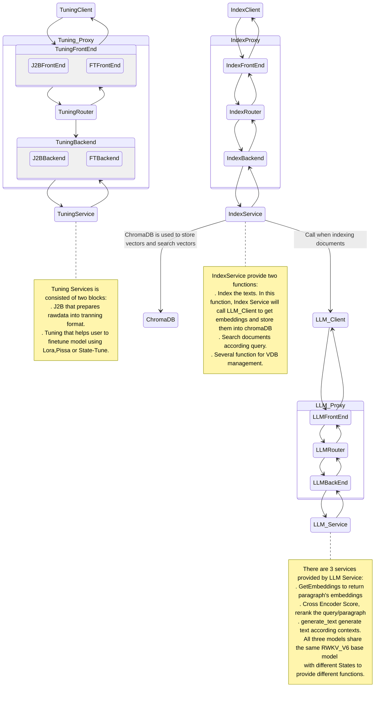

# 一键 RAG  

这是一个名为“RWKV_RAG”的一键 RAG 系统。RWKV_RAG 采用了异步处理技术，允许服务的维护和更新可以独立进行。该系统设计没有任何封装，每一个步骤都可以任意调用接口。

此外，RWKV_RAG 集成了一键工具用于 StateTune，这是一种专门针对 RWKV 的极其高效的微调方法。此外，RWKV_RAG 还支持 Lora 和 Pissa，为用户提供了便捷的 PEFT（参数高效微调）解决方案，以应对各种下游任务。该框架中的模型在中文数据集上进行了调优，因此，RWKV_RAG 目前在中文任务上表现更佳。然而，英语调优模型也正在开发中。 


# 系统设计

即使是最小化的 RAG 系统也涉及多个子系统，这些子系统可能会相互互动。为了提高开发灵活性并平滑开发曲线，我们设计了一个基于队列的 RAG 系统。

每个组件都必须是可插拔的且易于扩展。这意味着 RPC 不应该硬编码为特定的协议，如 TCP/InProc/InterProcess 等。

最佳设计模式是发布-订阅模型，即每个组件连接到一个代理（或中介）以发送请求和接收响应。通常，像 RabbitMQ、RocketMQ 这样的重型消息队列被用来确保效率和可靠性。然而，消息队列服务本身也是一个需要管理和维护的复杂系统。

在这里，我们的新设计是使用一个无代理的队列库 ZeroMQ 作为队列服务。

得益于 ZeroMQ 可靠且高性能的实现，这个框架可以从单个资源受限的节点扩展到多节点的大型系统。

RWKV_RAG 系统的架构如下：




## 模型下载

请从以下链接下载基线模型: https://huggingface.co/BlinkDL

请从以下链接下载聊天机器人的状态文件: https://huggingface.co/SupYumm/rwkv6_7b_qabot/tree/main

嵌入模型和重排序模型有多种选项:

  请从以下链接下载 RWKV 嵌入模型: https://huggingface.co/yueyulin/rwkv6_emb_4k_base 
  
  请从以下链接下载 BGEM3 嵌入模型: https://huggingface.co/BAAI/bge-m3 
  
  请从以下链接下载 BGEM3 重排序模型: https://huggingface.co/BAAI/bge-reranker-v2-m3

请随时在 config.yaml 文件中更改您自己的嵌入模型和重排序模型。目前，BGEM3 是一个理想的选项；然而，RWKV 嵌入模型和重排序模型的更好性能版本也在开发中。

以下部分将描述当前的实现情况。未来将会有更多功能的更新，但基本设计将保持不变。


# 快速开始

## 安装依赖以及显存要求

请安装 requirement.txt 中列出的依赖项
```shell
pip install -r requirement.txt 
```
以下是不同参数下 RWKV 模型的 VRAM 推荐配置

| SIZE | VRAM |
|----------|----------|
| 1.6b   | 4G   |
| 3b   | 7.5G   |
| 7b   | 18G |
|12b   | 24G|
|14b |30G|


## 修改配置文件
您可以通过配置文件 ragq.yml 控制所有服务的启用或禁用。默认情况下，所有服务都是启用的。在使用之前，您需要修改以下配置项以适应某些服务。

### LLM Service
嵌入、重排序和生成文本。
- base_model_file: RWKV 基线模型路径，请参考  [RWKV基模下载](https://rwkv.cn/RWKV-Fine-Tuning/Introduction#%E4%B8%8B%E8%BD%BD%E5%9F%BA%E5%BA%95-rwkv-%E6%A8%A1%E5%9E%8B) or 或模型下载
 - bgem3_path: 嵌入模型路径，推荐使用: bge-m31
 - rerank_path: 重排序模型路径，推荐使用: BAAIbge-reranker-v2-m3
 - state_path: 记忆状态路径；记忆状态是通过状态微调生成的。

### Index Service
- chroma_db_path: ChromaDB 数据库路径
- chroma_port: ChromaDB 端口
- chroma_host: ChromaDB 主机 IP
- sqlite_db_path: sqlight 数据库路径

### Tuning Service

默认值适用于 rwkv6_1.6b

## Start Services
```shell
python3 service.py 
```

## Start Client
```shell
streamlit run client.py
```
在浏览器中打开 Streamlit 提供的 URL。

## Notes
- 推荐使用 Python 3.10 或 Python 3.9。
- PyTorch Lightning 必须使用版本 1.9.5。
- 当前版本在使用微调功能时，会重新加载基线模型，因此需要合理分配 GPU 内存，以避免因 VRAM 不足而导致的错误。

# 使用手册

## 向量数据库管理

该用户界面支持 VDB 集合的搜索、集合的创建和删除，以及集合内容的管理。

<div style="width: 35%; height: auto;text-align:center">
  
</div>

## Building knowledgebase

该用户界面支持三种不同的方法将内容索引到知识库中：手动输入、从本地计算机上传、从本地服务器上传。
AIIRWKV 还支持互联网搜索，将实时数据从互联网索引到知识库中
用户可以根据不同情况选择适当的块大小和块重叠。

<div style="width: 35%; height: auto;text-align:center">
  
</div>


## 一键微调RWKV

### WanDB
请注册 WanDB 以监控微调过程的状态，特别是损失曲线。

在后台终端上会显示一个任务栏，用于跟踪微调过程。

### 设置微调参数

在使用 1024 上下文窗口进行 RWKV 模型微调时的 VRAM 需求

| Size      | fp16       | int8       | nf4       |
|---------------|------------|------------|-----------|
| RWKV6-1.6B    | 5.8GB GPU  | 4.5GB GPU  | 3.9GB GPU |
| RWKV6-3B      | 8.7GB GPU  | 6.2GB GPU  | 4.9GB GPU |
| RWKV6-7B      | 17.8GB GPU | 11.9GB GPU | 8.5GB GPU |

有关其他参数和超参数的详细解释，请参阅官方教程：https://rwkv.cn/RWKV-Fine-Tuning/State-Tuning

<div style="width: 35%; height: auto;text-align:center">
  
</div>

## RAG CHATBOT

请从知识库中检索最相关的信息，然后针对这些信息提出问题。
用户可以在 UI 上动态修改基底模型和记忆状态。
AIIRWKV 是一个聊天机器人，可以基于最近 6 回合对话中的所有信息提供准确的答案。
用户可以随时更改记忆状态以适应不同的下游任务。

<div style="width: 35%; height: auto;text-align:center">
  
</div>

# 未来展望

以 ASR 和视觉为主的多模态框架将很快上线。此外，GraphRAG 和提示优化也在开发中。

# Acknowledgement
- 所有 RWKV 微调服务改编自 [J.L](https://github.com/JL-er/RWKV-PEFT)
- 所有 RWKV 模型来自 [BlinkDL](https://github.com/BlinkDL/RWKV-LM)
- 作者: [YYnil](https://github.com/yynil) ; [Ojiyum](https://github.com/Ojiyumm) ;  [LonghuaLiu](https://github.com/Liu3420175)
