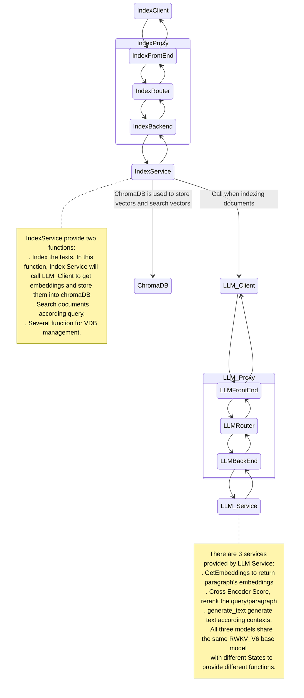

<p align="center">
  <a href="./README.md">简体中文</a> |
    <a href="./Readme_Eng.md">English</a> 
</p>

<details open>
<summary></b>📕 目录</b></summary>

- 💡 [什么是RWKV-RAG?](#-什么是RWKV-RAG?)
- 🌟 [主要特性](#-主要特性)
- 🔎 [系统架构](#-系统架构)
- 🎬 [开始使用](#-开始使用)
  - 🚀 [启动模型服务](#-启动模型服务)
</details>


## 💡 什么是RWKV-RAG?

RWKV-RAG 是基于 [RWKV](https://www.rwkv.cn/) 模型的开源的RAG系统。它为任何规模的企业提供了一个可轻松搭建和管理本地知识库的服务，并提供了基于本地知识库的问答机器人（RWKV-RAG-CHAT）。

RWKV-RAG 使用的模型针对中文数据集进行调优，因此在中文任务上表现更佳。我们也在开发英文调优的模型，敬请期待。 


## 🌟 主要特性
### 🍭 **异步分布式架构**

- 基于消息队列的异步分布式架构。子系统解耦合，可以独立部署。
- 支持单机部署和集群部署，适用于任何规模的企业。

    > [!TIP]
    > 
    > RWKV-RAG也推出了[个人版](https://github.com/AIIRWKV/RWKV-RAG-Personal)，适合个人用户使用。
    > 
  
### 🍔 **支持多种数据源**

- 支持 Excel、文本、PDF、网页等。

### 🛀 **部署简单**

- 每个子系统都有Docker部署脚本，只需简单配置即可部署。
- 可配置的大型语言模型以及嵌入模型。
- 支持多种向量数据库。同时可根据自己的需求在项目向量数据库适配层做一些简单的开发工作即可集成新的向量数据库。


## 🔎 系统架构

即使是最小化的 RAG 系统也会涉及多个子系统，这些子系统可能会相互影响。为了提高开发灵活性，我们设计了一个基于队列的 RAG 系统。

我们认为一个健壮的 RAG 系统其每个组件都必须可插拔且易于扩展，因此远程过程调用不应该是硬编码的方式，比如TCP/InProc/InterProcess等。

理论上，RAG 的最佳通信模式应该是是发布-订阅模型（Pub/Sub），即每个组件连接到一个代理-Broker（或称为中介-Mediator）以发送请求和接收响应。
通常，为了确保效率和可靠性，会使用像```RabbitMQ```、```RocketMQ```这样的重量级消息队列。 这些消息队列服务本身也是需要管理和维护的复杂系统，这无疑增加了 RAG 的使用门槛和维护成本。

综合以上考虑，我们对 RWKV-RAG 的设计是**使用一个无代理的队列库 [ZeroMQ](https://github.com/zeromq) 作为队列服务**。得益于 ZeroMQ 稳定且高性能的实现，
我们可以实现RWKV-RAG 从单个资源受限的节点扩展到多节点的大型分布式系统。RWKV-RAG系统架构如下：



## 🎬 开始使用

### 📝 先决条件

RWKV-RAG是基于 Docker部署的，因此需要先安装 Docker。如果您尚未在本地计算机上安装 Docker，请参阅[安装 Docker Engine](https://docs.docker.com/engine/install/)。

### 🚀 启动模型服务

<br>

#### 🔧 构建包含模型的 Docker 镜像

该镜像构建完后大小约为20GB。由于模型服务需要加载本地模型，对硬件配置有一定的要求。
- CPU >= 4 cores
- RAM >= 16GB 
    > 使用的模型文件越大，需要的内存也会越大。
- Disk >= 50GB
- GPU >= 1
  > 显卡内存要求与模型大小有关。各参数 RWKV模型需要的现存要求如下：
  > 
  > | SIZE       | VRAM 
  > ------------|----------
  > | RWKV-6-1B6 | 4G   |
  > | RWKV-6-3B  | 7.5G   
  > | RWKV-6-7B  | 18G |
  > | RWKV-6-12B | 24G|
  >  | RWKV-6-14B |30G|
  >

##### 1. 安装 NVIDIA Container Toolkit

在Docker容器中使用CUDA，需要先安装NVIDIA Container Toolkit。如果你还没有安装 NVIDIA Container Toolkit，你可以按照以下步骤进行安装：
```shell
distribution=$(. /etc/os-release;echo $ID$VERSION_ID)
curl -s -L https://nvidia.github.io/nvidia-docker/gpgkey | sudo apt-key add -
curl -s -L https://nvidia.github.io/nvidia-docker/$distribution/nvidia-docker.list | sudo tee /etc/apt/sources.list.d/nvidia-docker.list
sudo apt-get update
sudo apt-get install -y nvidia-docker2
```
安装完成后，重启docker
```shell
sudo systemctl restart docker
```

##### 2. 构建镜像

```bash
git clone https://github.com/AIIRWKV/RWKV-RAG.git
cd RWKV-RAG/docker
sudo docker build -f DockerfileLLMService -t rwkv_rag/rwkv_rag_llm_service:latest .
```

> [!TIP]
> 
> 构建时间会有一些长，后续会将镜像上传到docker hub，方便直接拉取。
> 

##### 3. 下载模型文件

请将以下模型下载到工作区：

- 下载 RWKV base model（基底模型）：[HuggingFace下载地址](https://huggingface.co/SupYumm/rwkv6_rag_qabot/tree/main)
- 下载 BGEM3 重排序模型（rerank model）：[HuggingFace下载地址](https://huggingface.co/BAAI/bge-reranker-v2-m3)  [modelscope下载地址](https://modelscope.cn/models/BAAI/bge-reranker-v2-m3)
- 下载 BGEM3 Embedding 模型: [[HuggingFace下载地址](https://huggingface.co/BAAI/bge-m3)   [modelscope下载地址](https://modelscope.cn/models/BAAI/bge-m3)

> [!TIP]  
> 
> 建议模型文件放在宿主机同一个文件夹，我们是通过挂载的方式将宿主机存放模型的目录挂载到容器的```/root/models```目录下，便于管理，如下图示例所示。
> 
> 


##### 4. 修改配置文件
修改项目```etc/llm_service_config.yml```文件，主要三配置LLM模型、嵌入模型、rerank模型路径以及后端服务。

- **base_model_path**: RWKV 基底模型的路径，请参考 [RWKV 模型下载](https://rwkv.cn/RWKV-Fine-Tuning/Introduction#%E4%B8%8B%E8%BD%BD%E5%9F%BA%E5%BA%95-rwkv-%E6%A8%A1%E5%9E%8B) 
- **embedding_path**: 嵌入模型的路径，推荐使用: bge-m31
- **reranker_path**: 重排序模型的路径，推荐使用: BAAIbge-reranker-v2-m3
- **back_end**: LLM后端服务配置，通过该配置对外提供服务。推荐使用默认值。
  - **host**: 0.0.0.0
  - **port**: 7782
  - **protocol**: tcp

> [!WARNING]
> 
> 在前文提到过宿主机存放模型的目录挂载到容器的```/root/models```目录下，所以在修改模型路径时，不要修改路径的```/root/models```前缀。
> 

#### 5. 启动容器
假设将模型文件都下载到了宿主机的```/home/rwkv/models```目录下，配置文件路径```/home/rwkv/RWKV-RAG/etc/llm_service_config.yml```，通过挂载模型和配置文件启动容器，命令如下：

```bash
sudo docker run -it --gpus all --name rwkv_rag_llm_service  -p 7782:7782  -v /home/rwkv/models:/root/models  -v /home/rwkv/RWKV-RAG/etc/llm_service_config.yml:/root/RWKV-RAG/etc/llm_service_config.yml rwkv_rag/rwkv_rag_llm_service:latest
```