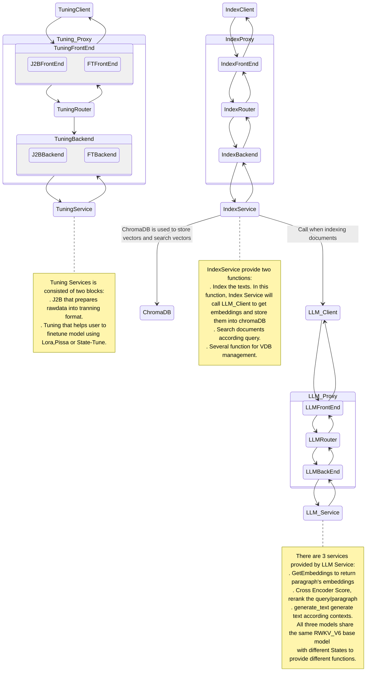

# RWKV-RAG  

RWKV-RAG 是一个基于 RWKV 模型的一键 RAG 部署系统，可轻松搭建和管理本地知识库，同时提供了基于本地知识库的问答机器人和 RWKV 一键微调功能。

RWKV-RAG 使用的模型针对中文数据集进行调优，因此在中文任务上表现更佳。我们也在开发英文调优的模型，敬请期待。 

> [!WARNING]  
> 
> RWKV-RAG 当前只支持 Linux 部署，暂无 Windows 或 MacOS 版本。

## 特性

- **💻 带图形化界面：** RWKV RAG 的主要功能都有用户友好的 Web-GUI 界面，供直观且易于操作的用户体验
- **⛓️ 异步处理系统：** RWKV-RAG 系统采用了异步处理技术，可以独立进行服务的维护和更新
- **🎛️ 最小封装设计：** RWKV-RAG 系统没有任何封装，每一个步骤都可以任意调用 API 接口
- **⚒️ 支持多种微调方法：** RWKV-RAG 支持 Lora 和 Pissa 等 RWKV 高效微调方法，此外也集成了一键 StateTune 工具（一种专门针对 RWKV 的极其高效的微调方法）

## 模型下载

- 下载 RWKV base model（基底模型）：https://huggingface.co/BlinkDL
- 下载用于 Chat-bot 功能的 State 文件：https://huggingface.co/SupYumm/rwkv6_7b_qabot/tree/main
- 下载 BGEM3 重排序模型（Rerank model）：https://huggingface.co/BAAI/bge-reranker-v2-m3
- 选择下载一项嵌入模型（embedding model）
  - 下载 RWKV Embedding 模型: https://huggingface.co/yueyulin/rwkv6_emb_4k_base 
  - 下载 BGEM3 Embedding 模型: https://huggingface.co/BAAI/bge-m3 

> [!TIP]  
> 你可以通过更改 `ragq.yml` 文件来更改 RWKV-RAG 系统使用的 embedding model 和 rerank model。

目前 BGEM3 更适合作为 embedding 模型，我们也在开发性能更强的 RWKV embedding 和 rerank 模型。

## 下载和安装

1. 克隆 RWKV-RAG 仓库

```
git clone https://github.com/shoumenchougou/RWKV_RAG.git
```

2. 安装依赖项
   
请安装 requirement.txt 中列出的依赖项：

```shell
pip install -r requirements.txt 
```
> [!TIP]  
> 
> - 推荐使用 Python 3.10 或 Python 3.9
> - 推荐使用 torch 2.2.2+cu121
> - PyTorch Lightning **必须**使用版本 1.9.5

3. 确认 VRAM 是否充足

以下是不同参数下 RWKV 模型的 VRAM 推荐配置，请确认你的 VRAM 规格并选择合适的 RWKV base model 。

| SIZE | VRAM |
|----------|----------|
| 1.6b   | 4G   |
| 3b   | 7.5G   |
| 7b   | 18G |
|12b   | 24G|
|14b |30G|

> [!WARNING]  
> 
> 当前 RWKV-RAG 一键微调功能会重新加载 RWKV base model 模型。因此需要合理分配 GPU 内存，以避免因 VRAM 不足而导致的错误。

## 修改配置文件

RWKV-RAG 默认启用所有服务，您可以通过修改配置文件 `ragq.yml` 来启用或禁用某一项服务。

### LLM Service

嵌入、重排序和生成文本。
- base_model_file: RWKV 基线模型路径，请参考  [RWKV基模下载](https://rwkv.cn/RWKV-Fine-Tuning/Introduction#%E4%B8%8B%E8%BD%BD%E5%9F%BA%E5%BA%95-rwkv-%E6%A8%A1%E5%9E%8B) or 或模型下载
 - bgem3_path: 嵌入模型路径，推荐使用: bge-m31
 - rerank_path: 重排序模型路径，推荐使用: BAAIbge-reranker-v2-m3
 - state_path: 记忆状态路径；记忆状态是通过状态微调生成的。

### Index Service
- chroma_db_path: ChromaDB 数据库路径
- chroma_port: ChromaDB 端口
- chroma_host: ChromaDB 主机 IP
- sqlite_db_path: sqlight 数据库路径

### Tuning Service

此外，Tuning Service（微调服务）的默认参数适用于 RWKV-6-1.6B 基底模型。如果你需要微调其他参数的模型，请修改 `ragq.yml` 中的 `Tuning` 参数。

## Start Services

使用以下命令启动 RWKV-RAG 服务：

```shell
python3 service.py 
```

## Start Client

使用以下命令启动 WebUI 的客户端：

```shell
streamlit run client.py
```
在浏览器中打开 Streamlit 提供的 URL。

# 使用手册

## 向量数据库管理

该用户界面支持 VDB 集合的搜索、集合的创建和删除，以及集合内容的管理。

<div style="width: 35%; height: auto;text-align:center">
  
</div>

## Building knowledgebase

该用户界面支持三种不同的方法将内容索引到知识库中：手动输入、从本地计算机上传、从本地服务器上传。
RWKV-RAG 还支持互联网搜索，将实时数据从互联网索引到知识库中
用户可以根据不同情况选择适当的块大小和块重叠。

<div style="width: 35%; height: auto;text-align:center">
  
</div>


## 一键微调RWKV

### WanDB
请注册 WanDB 以监控微调过程的状态，特别是损失曲线。

在后台终端上会显示一个任务栏，用于跟踪微调过程。

### 设置微调参数

在使用 1024 上下文窗口进行 RWKV 模型微调时的 VRAM 需求

| Size      | fp16       | int8       | nf4       |
|---------------|------------|------------|-----------|
| RWKV6-1.6B    | 5.8GB GPU  | 4.5GB GPU  | 3.9GB GPU |
| RWKV6-3B      | 8.7GB GPU  | 6.2GB GPU  | 4.9GB GPU |
| RWKV6-7B      | 17.8GB GPU | 11.9GB GPU | 8.5GB GPU |

有关其他参数和超参数的详细解释，请参阅官方教程：https://rwkv.cn/RWKV-Fine-Tuning/State-Tuning

<div style="width: 35%; height: auto;text-align:center">
  
</div>

## RAG CHATBOT

请从知识库中检索最相关的信息，然后针对这些信息提出问题。
用户可以在 UI 上动态修改基底模型和记忆状态。
RWKV-RAG 是一个聊天机器人，可以基于最近 6 回合对话中的所有信息提供准确的答案。
用户可以随时更改记忆状态以适应不同的下游任务。

<div style="width: 35%; height: auto;text-align:center">
  
</div>


## 系统设计

即使是最小化的 RAG 系统也会涉及多个子系统，这些子系统可能会相互影响。为了提高开发灵活性并平滑开发曲线，我们设计了一个基于队列的 RAG 系统。

我们认为一个健壮的 RAG 系统其每个组件都必须可插拔且易于扩展，因此远程过程调用（RPC）不应该硬编码为 TCP/InProc/InterProcess 等特定通信协议。

理论上，RWKV-RAG 的最佳通信模式应该是是发布-订阅模型（Pub/Sub），即每个组件连接到一个代理-Broker（或称为中介-Mediator）以发送请求和接收响应。

然而，Pub/Sub 通信通常使用 RabbitMQ、RocketMQ 这样的消息队列。这些消息队列服务本身也是需要管理和维护的复杂系统，这无疑增加了 RWKV-RAG 的使用门槛和维护成本。

综合以上考虑，我们对 RWKV-RAG 的设计是**使用一个无代理的队列库 [ZeroMQ](https://github.com/zeromq) 作为队列服务**。得益于 ZeroMQ 稳定且高性能的实现，RWKV-RAG 框架可以从单个资源受限的节点扩展到多节点的大型系统。

RWKV_RAG 系统的架构如下：



## 未来计划

以 ASR 和视觉为主的多模态框架将很快上线。此外，GraphRAG 和提示优化也在开发中。

## Acknowledgement
- 所有 RWKV 微调服务改编自 [@J.L ](https://github.com/JL-er)的 [RWKV-PEFT](https://github.com/JL-er/RWKV-PEFT) 项目
- 所有 RWKV 模型来自 [@BlinkDL](https://github.com/BlinkDL) 的 [RWKV-LM ](https://github.com/BlinkDL/RWKV-LM)项目
- 项目作者：[YYnil](https://github.com/yynil) ; [Ojiyum](https://github.com/Ojiyumm) ;  [LonghuaLiu](https://github.com/Liu3420175)
