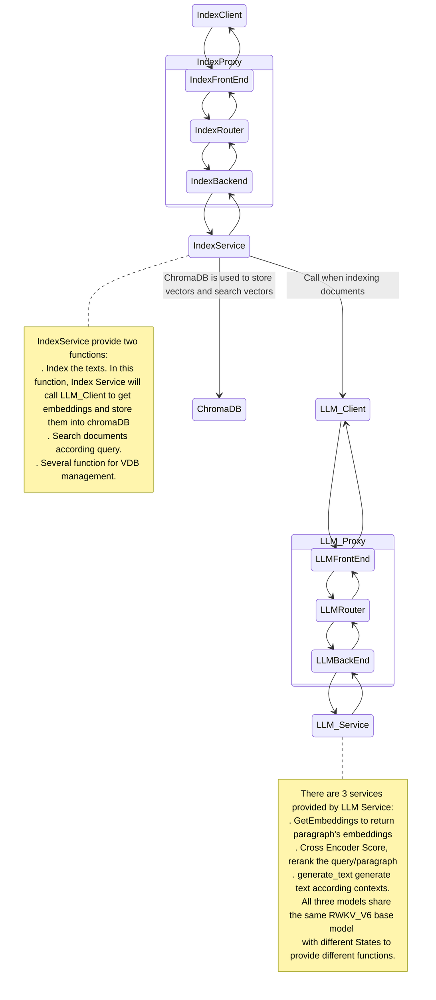
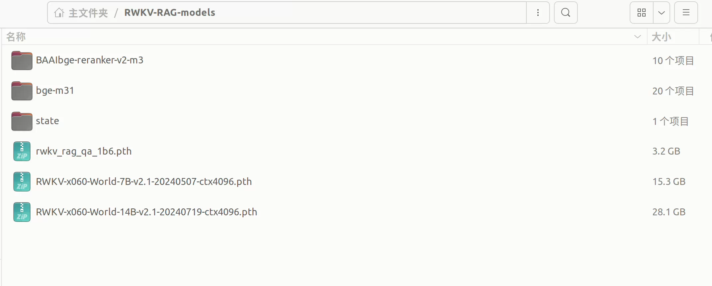

<p align="center">
  <a href="./README.md">简体中文</a> |
    <a href="./Readme_Eng.md">English</a> 
</p>

<details open>
<summary></b>📕 目录</b></summary>

- 💡 [什么是RWKV-RAG?](#-什么是RWKV-RAG?)
- 🌟 [主要特性](#-主要特性)
- 🔎 [系统架构](#-系统架构)
- 🎬 [开始使用](#-开始使用)
  - 🚀 [启动消息队列服务](#-启动消息队列服务)
  - 🚀 [启动模型服务](#-启动模型服务)
  - 🚀 [启动数据索引及检索服务](#-启动数据索引及检索服务)
  - 🚀 [启动客户端服务](#-启动客户端服务)
- 📚 [文档](#-文档)
- 🌹 [致谢](#-致谢)
- 🙌 [贡献](#-贡献)
</details>


## 💡 什么是RWKV-RAG?

RWKV-RAG 是基于 [RWKV](https://www.rwkv.cn/) 模型的开源的RAG系统。它为任何规模的企业提供了一个可轻松搭建和管理本地知识库的服务，并提供了基于本地知识库的问答机器人（RWKV-RAG-CHAT）。

RWKV-RAG 使用的模型针对中文数据集进行调优，因此在中文任务上表现更佳。我们也在开发英文调优的模型，敬请期待。 

----

## 🌟 主要特性
### 🍭 **异步分布式架构**

- 基于消息队列的异步分布式架构。子系统解耦合，可以独立部署。
- 支持单机部署和集群部署，适用于任何规模的企业。

>  [!TIP]
> 
>  RWKV-RAG也推出了[个人版](https://github.com/AIIRWKV/RWKV-RAG-Personal)，适合个人用户使用。
>

  
### 🍔 **支持多种数据源**

- 支持 Excel、文本、PDF、网页等。

### 🛀 **部署简单**

- 每个子系统都有Docker部署脚本，只需简单配置即可部署。
- 可配置的大型语言模型以及嵌入模型。
- 支持多种向量数据库。同时可根据自己的需求在项目向量数据库适配层做一些简单的开发工作即可集成新的向量数据库。


## 🔎 系统架构

即使是最小化的 RAG 系统也会涉及多个子系统，这些子系统可能会相互影响。为了提高开发灵活性，我们设计了一个基于队列的 RAG 系统。

我们认为一个健壮的 RAG 系统其每个组件都必须可插拔且易于扩展，因此远程过程调用不应该是硬编码的方式，比如TCP/InProc/InterProcess等。

理论上，RAG 的最佳通信模式应该是是发布-订阅模型（Pub/Sub），即每个组件连接到一个代理-Broker（或称为中介-Mediator）以发送请求和接收响应。
通常，为了确保效率和可靠性，会使用像```RabbitMQ```、```RocketMQ```这样的重量级消息队列。 这些消息队列服务本身也是需要管理和维护的复杂系统，这无疑增加了 RAG 的使用门槛和维护成本。

综合以上考虑，我们对 RWKV-RAG 的设计是**使用一个无代理的队列库 [ZeroMQ](https://github.com/zeromq) 作为队列服务**。得益于 ZeroMQ 稳定且高性能的实现，
我们可以实现RWKV-RAG 从单个资源受限的节点扩展到多节点的大型分布式系统。RWKV-RAG系统架构如下：



## 🎬 开始使用

RWKV-RAG是基于 Docker部署的，因此需要先安装 Docker。如果您尚未在本地计算机上安装 Docker，请参阅[安装 Docker Engine](https://docs.docker.com/engine/install/)。

### 🚀 启动消息队列服务

RWKV-RAG 是基于```ZeroMQ```的异步分布式架构，采用了```ZeroMQ```的代理模式来实现各个子系统之间的通信。如果你对该部分技术细节不是很了解，建议查看相关文档。

在启动其它服务之前，先要启动消息队列服务，同时代理模式需要配置前端套接字和后端套接字，它的作用类似于前端套接字负责接收用户请求，后端套接字负责将请求转发给子系统并返回处理结果。

#### 1. 🏢构建镜像

该服务镜像构建完后大小约为1GB。
```bash
git clone https://github.com/AIIRWKV/RWKV-RAG.git # 如果之前已经clone，则跳过这一步
cd RWKV-RAG/docker
sudo docker build -f DockerfileProxyService -t rwkv_rag/rwkv_rag_proxy_service:latest .
```

#### 2. 🔧 修改配置文件
修改项目```etc/proxy_service_config.yml```文件，主要是配置各个子系统的代理相关参数。

配置示例如下：
```yaml
llm:  # 模型服务代理配置
  front_end:  # 前端套接字配置，
    host: 0.0.0.0  # 消息队列服务器地址，默认是0.0.0.0，这样可通过宿主机IP地址访问
    protocol: tcp
    port: 7781
  back_end:  # 后端套接字配置
    host: 0.0.0.0op # 消息队列服务器地址，默认是0.0.0.0，这样可通过宿主机IP地址访问
    protocol: tcp
    port: 7782   
```
这样客户端可以通过消息队列服务器的7781端口发布消息，子系统后端通过消息队列服务器7782端口接收消息。其它子系统的代理配置类似。

#### 3. 🚀启动容器
假设宿主机配置文件路径```/home/rwkv/RWKV-RAG/etc/proxy_service_config.yml```，通过挂载方式，避免进入容器修改配置文件。启动容器，命令如下：

```bash
sudo docker run -it --name rwkv_rag_proxy_service  -p 7781:7781 -p 7782:7782 -p 7783:7783 -p 7784:7784  -v /home/rwkv/RWKV-RAG/etc/proxy_service_config.yml:/root/RWKV-RAG/etc/proxy_service_config.yml rwkv_rag/rwkv_rag_proxy_service:latest
```

> [!WARNING]
> 
> ```etc/proxy_service_config.yml```中配置的端口都需要映射到宿主机，否则无法访问。

---
### 🚀 启动模型服务


#### 📝 前提条件

该服务镜像构建完后大小约为20GB。由于模型服务需要加载本地模型，需要提前安装[**NVIDIA驱动程序**](https://www.nvidia.cn/drivers/lookup/)和[**CUDA12.1+**](https://developer.nvidia.com/cuda-downloads)，同时对硬件配置有一定的要求。
- CPU >= 4 cores
- RAM >= 16GB 
    > 使用的模型文件越大，需要的内存也会越大。
- Disk >= 50GB
- NVIDIA GPU >= 1
  > 显卡内存要求与模型大小有关。各参数 RWKV模型需要的现存要求如下：
  > 
  > | SIZE       | VRAM 
  > ------------|----------
  > | RWKV-6-1B6 | 4G   |
  > | RWKV-6-3B  | 7.5G   
  > | RWKV-6-7B  | 18G |
  > | RWKV-6-12B | 24G|
  >  | RWKV-6-14B |30G|
  >

####  1. 🔨安装 NVIDIA Container Toolkit

在Docker容器中使用CUDA，需要先安装NVIDIA Container Toolkit。如果你还没有安装 NVIDIA Container Toolkit，你可以按照以下步骤进行安装：
```shell
distribution=$(. /etc/os-release;echo $ID$VERSION_ID)
curl -s -L https://nvidia.github.io/nvidia-docker/gpgkey | sudo apt-key add -
curl -s -L https://nvidia.github.io/nvidia-docker/$distribution/nvidia-docker.list | sudo tee /etc/apt/sources.list.d/nvidia-docker.list
sudo apt-get update
sudo apt-get install -y nvidia-docker2
```
安装完成后，重启docker
```shell
sudo systemctl restart docker
```

#### 2. 🏢构建镜像

```bash
git clone https://github.com/AIIRWKV/RWKV-RAG.git
cd RWKV-RAG/docker
sudo docker build -f DockerfileLLMService -t rwkv_rag/rwkv_rag_llm_service:latest .
```

> [!TIP]
> 
> 构建时间会有一些长，后续会将镜像上传到docker hub，方便直接拉取。
> 

#### 3.  ⬇下载模型文件

请将以下模型下载到工作区：

- 下载 RWKV base model（基底模型）：[HuggingFace下载地址](https://huggingface.co/SupYumm/rwkv6_rag_qabot/tree/main)
- 下载 BGEM3 重排序模型（rerank model）：[HuggingFace下载地址](https://huggingface.co/BAAI/bge-reranker-v2-m3)  [modelscope下载地址](https://modelscope.cn/models/BAAI/bge-reranker-v2-m3)
- 下载 BGEM3 Embedding 模型: [[HuggingFace下载地址](https://huggingface.co/BAAI/bge-m3)   [modelscope下载地址](https://modelscope.cn/models/BAAI/bge-m3)

> [!TIP]  
> 
> 建议模型文件放在宿主机同一个文件夹，我们是通过挂载的方式将宿主机存放模型的目录挂载到容器的```/root/models```目录下，便于管理，如下图示例所示。
> 
> 


#### 4. 🔧 修改配置文件
修改项目```etc/llm_service_config.yml```文件，主要是配置LLM模型、嵌入模型、rerank模型路径以及后端服务。

- **base_model_path**: RWKV 基底模型的路径，请参考 [RWKV 模型下载](https://rwkv.cn/RWKV-Fine-Tuning/Introduction#%E4%B8%8B%E8%BD%BD%E5%9F%BA%E5%BA%95-rwkv-%E6%A8%A1%E5%9E%8B) 
- **embedding_path**: 嵌入模型的路径，推荐使用: bge-m31
- **reranker_path**: 重排序模型的路径，推荐使用: BAAIbge-reranker-v2-m3
- **back_end**: 消息队列服务模型服务相关的代理模式配置中的后端套接字配置
  - **host**: 消息队列服务器IP地址
  - **port**: 7782
  - **protocol**: tcp

> [!WARNING]
> 
> 在前文提到过宿主机存放模型的目录挂载到容器的```/root/models```目录下，所以在修改模型路径时，不要修改路径的```/root/models```前缀。
> 

#### 5. 🚀启动容器
假设将模型文件都下载到了宿主机的```/home/rwkv/models```目录下，配置文件路径```/home/rwkv/RWKV-RAG/etc/llm_service_config.yml```，启动容器，命令如下：

```bash
sudo docker run -it --gpus all --name rwkv_rag_llm_service  -v /home/rwkv/models:/root/models  -v /home/rwkv/RWKV-RAG/etc/llm_service_config.yml:/root/RWKV-RAG/etc/llm_service_config.yml rwkv_rag/rwkv_rag_llm_service:latest
```

<br>

### 🚀 启动数据索引及检索服务

<br>

#### 1. 🌱向量数据库 Docker部署

RWKV-RAG 默认使用的是ChromaDB向量数据库，后续将会集成一些其它的向量数据库。

> [!TIP]
> 
> 也可以根据需要集成一些感兴趣的向量数据库，只需要在项目的```src/vectordb/```目录下实现抽象类``` AbstractVectorDBManager```对应的接口即可。
>

```bash
sudo docker pull chromadb/chroma
sudo docker run --name chromadb_service -p 9998:8000 -v /home/rwkv/Data/chroma:/chroma/chroma -e IS_PERSISTENT=TRUE -e ANONYMIZED_TELEMETRY=TRUE chromadb/chroma:latest
```
- chromadb/chroma镜像暴露的端口是8000，用9998(可自行修改)端口做映射，这样可以通过宿主机的9999端口访问chromadb服务。如果能正常访问，说明部署成功。
- -v /home/rwkv/Data/chroma:/chroma/chroma 是将宿主机的/home/rwkv/Data/chroma目录挂载到chromadb的/chroma/chroma目录下，当容器删除时，数据不会丢失。这个需要根据你的服务器实际情况自行修改。


#### 2. 🏢构建镜像

该服务镜像构建完后大小约为1.5GB。
```bash
git clone https://github.com/AIIRWKV/RWKV-RAG.git # 如果之前已经clone，则跳过这一步
cd RWKV-RAG/docker
sudo docker build -f DockerfileIndexService -t rwkv_rag/rwkv_rag_index_service:latest .
```

#### 3. 🔧 修改配置文件
修改项目```etc/index_service_config.yml```文件，主要是向量数据库的服务地址以和后端服务。

- **vectordb_name**: 向量数据库类型，默认为chroma。
- **vectordb_host**: 向量数据库服务地址，**不能**是```localhost```或者**回环地址**，应该是部署向量数据库的**服务器IP地址**。
- **vectordb_port**: 9998，向量数据库服务端口
- **back_end**: 消息队列服务数据检索服务相关的代理模式配置中的后端套接字配置
  - **host**: 消息队列服务器IP地址
  - **port**: 7784
  - **protocol**: tcp


#### 4. 🚀启动容器
假设宿主机配置文件路径```/home/rwkv/RWKV-RAG/etc/index_service_config.yml```，启动容器，命令如下：

```bash
sudo docker run -it --name rwkv_rag_index_service -v /home/rwkv/RWKV-RAG/etc/index_service_config.yml:/root/RWKV-RAG/etc/index_service_config.yml rwkv_rag/rwkv_rag_index_service:latest
```


<br>

### 🚀 启动客户端服务

客户端是基于```streamlit```实现的一个简洁的交互式Web系统，同时也包含一些数据处理类的功能，后续会进行前后端分离，使用更丰富的交互方式，敬请期待！
#### 1. 🏢构建镜像

该服务镜像构建完后大小约为3.5GB。
```bash
git clone https://github.com/AIIRWKV/RWKV-RAG.git # 如果之前已经clone，则跳过这一步
cd RWKV-RAG/docker
sudo docker build -f DockerfileClient -t rwkv_rag/rwkv_rag_client:latest .
```

#### 2. 🔧 修改配置文件
修改项目```etc/ragq.yml```文件，主要是配置各个子系统的前端套接字配置。

配置示例如下：
```yaml
llm:  # 模型服务的配置
  front_end:  # 前端套接字配置
    host: 消息队列服务器IP地址
    protocol: tcp
    port: 7781
index: # 数据检索服务的配置
  front_end: # 前端套接字配置
    host: # 消息队列服务器IP地址
    protocol: tcp
    port: 7783
base:  # 基础配置
  knowledge_base_path:  # 知识库原始文件存储路径，确保路径存在
  sqlite_db_path: #后端数据库SQLite数据库文件路径，确保路径存在
```

#### 3. 🚀启动容器
假设宿主机配置文件路径```/home/rwkv/RWKV-RAG/etc/ragq.yml```，启动容器，命令如下：

```bash
sudo docker run -it --name rwkv_rag_client -p 8501:8501 -v /home/rwkv/RWKV-RAG/etc/ragq.yml:/root/RWKV-RAG/etc/ragq.yml rwkv_rag/rwkv_rag_client:latest
```


## 📚 文档
- [使用指南](docs/User_guide.md)


## 🌹致谢
- 所有 RWKV 微调服务改编自 [@J.L ](https://github.com/JL-er)的 [RWKV-PEFT](https://github.com/JL-er/RWKV-PEFT) 项目
- 所有 RWKV 模型来自 [@BlinkDL](https://github.com/BlinkDL) 的 [RWKV-LM ](https://github.com/BlinkDL/RWKV-LM)项目


## 🙌 贡献

RWKV-RAG 因其开放的协作环境而不断进步和成长。我们鼓励并欢迎社区的每一位成员积极参与贡献。如果您有兴趣加入我们的行列，请先阅读我们的[贡献指南](docs/CONTRIBUTING.md) 。