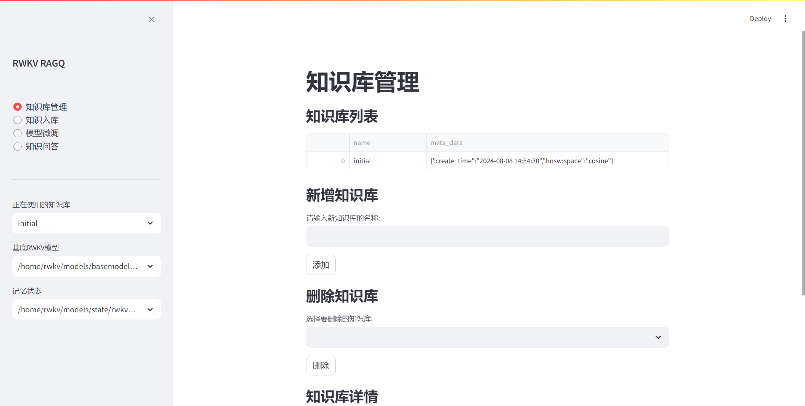
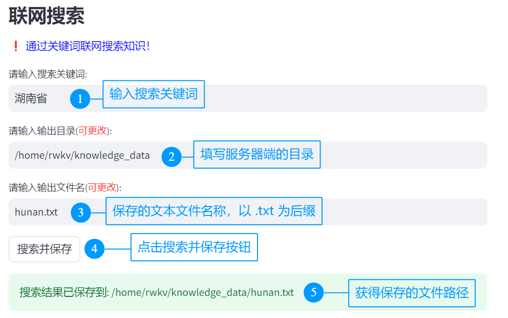
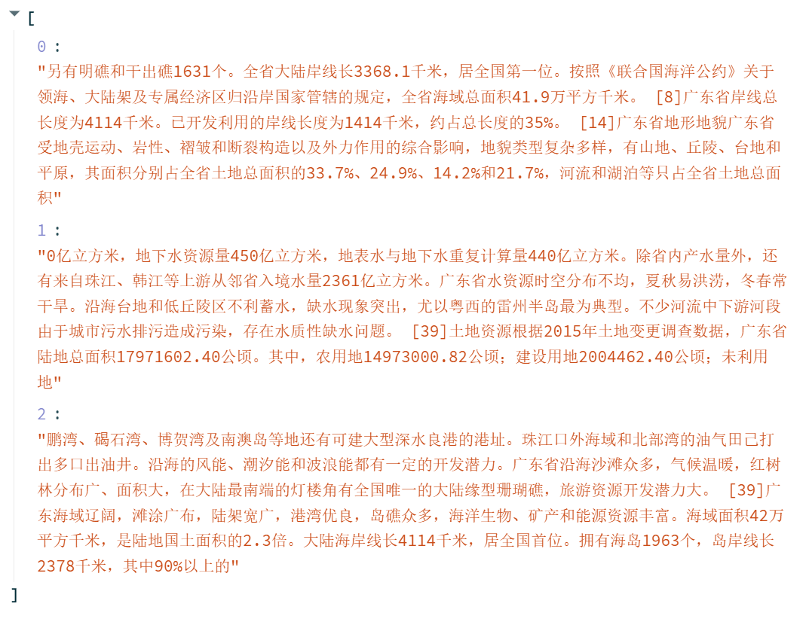
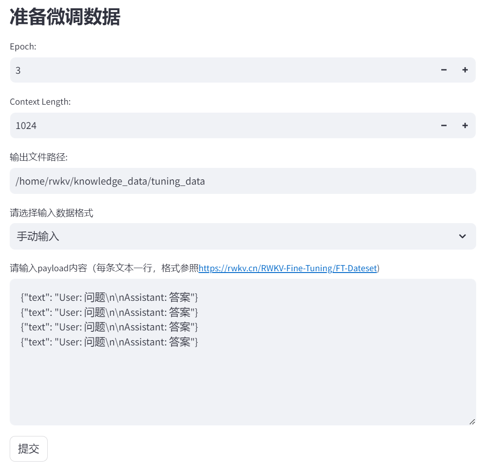
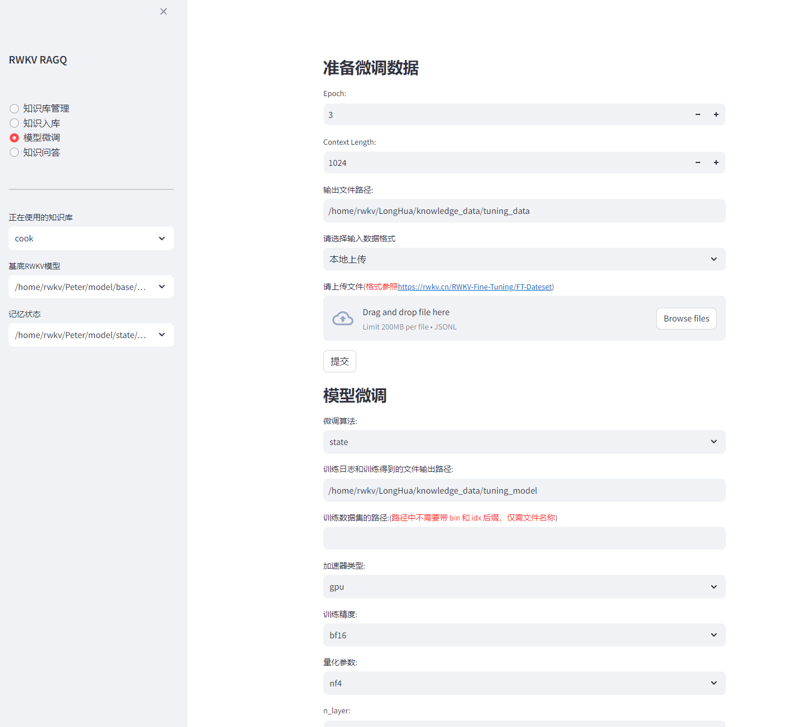
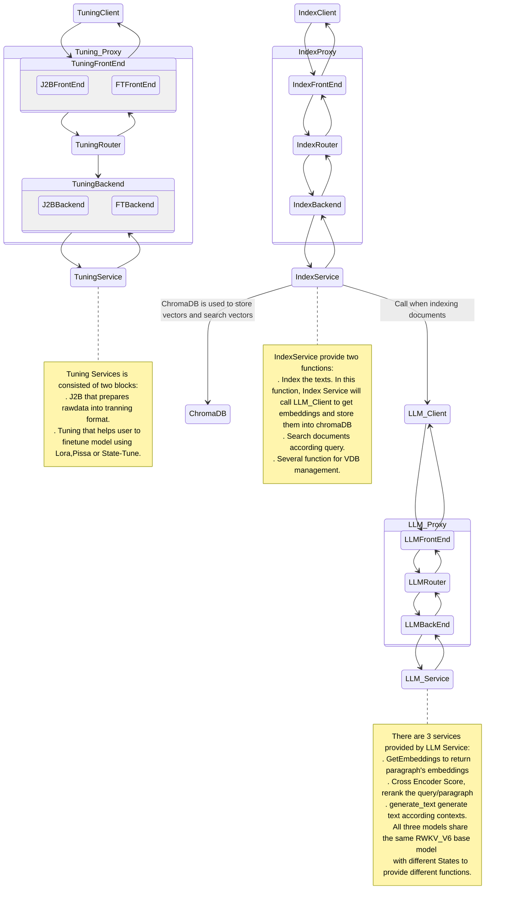

# RWKV-RAG  

RWKV-RAG 是一个基于 RWKV 模型的一键 RAG 部署系统，可轻松搭建和管理本地知识库，同时提供了基于本地知识库的问答机器人（RWKV-RAG-CHAT）和 RWKV 一键微调功能。

RWKV-RAG 使用的模型针对中文数据集进行调优，因此在中文任务上表现更佳。我们也在开发英文调优的模型，敬请期待。 

> [!WARNING]  
> 
> RWKV-RAG 当前只支持 Linux 部署，暂无 Windows 或 MacOS 版本。

## 特性

- **💻 带图形化界面：** RWKV-RAG 的主要功能都有用户友好的 WebUI 界面，提供直观且易于操作的用户体验
- **⛓️ 异步处理系统：** RWKV-RAG 系统采用了异步处理技术，你可以选择在单个服务器上部署部分服务，也可将服务拆分部署在不同的服务器上
- **🎛️ 最小封装设计：** RWKV-RAG 系统没有任何封装，每一个步骤都可以任意调用 API 接口
- **⚒️ 支持多种微调方法：** RWKV-RAG 支持 Lora 和 Pissa 等 RWKV 高效微调方法，此外也集成了一键 StateTune 工具（一种专门针对 RWKV 的极其高效的微调方法）

## 下载和安装

1. **克隆 RWKV-RAG 仓库**

```
git clone https://github.com/AIIRWKV/RWKV-RAG.git
```

2. **修改配置文件**

参考 [**修改配置文件**](#修改配置文件)

3. **安装依赖项**
   
请安装 requirement.txt 中列出的所有依赖项：

```shell
pip install -r requirements.txt 
```
> [!TIP]  
> 
> - 推荐使用 Python 3.10 或 Python 3.9
> - 推荐使用 torch 2.2.2+cu121
> - PyTorch Lightning **必须**使用 1.9.5 版本

4. **确认 VRAM 是否充足**

以下是各参数 RWKV 模型的**推理 VRAM 需求**。请确认设备 VRAM 并选择一个合适的 RWKV 模型作为 RWKV-RAG 系统：

| SIZE | VRAM |
|----------|----------|
| RWKV-6-1B6   | 4G   |
| RWKV-6-3B   | 7.5G   |
| RWKV-6-7B   | 18G |
| RWKV-6-12B   | 24G|
| RWKV-6-14B |30G|

> [!WARNING]  
> 
> 当前 RWKV-RAG 的**知识库功能**需要加载 RWKV 模型，**一键微调功能**会再次加载 RWKV 模型。
> 
> **同时使用知识库和微调服务时，需要合理分配 GPU 的显存，避免因显存不足而导致的错误。**

## 模型下载

完整的 RWKV-RAG 服务需要以下四种模型/文件，请将以下四类模型下载到你的 Linux 工作区：

- 下载 RWKV base model（基底模型）：https://huggingface.co/BlinkDL
- 下载 State 文件（用于问答机器人功能）：https://huggingface.co/SupYumm/rwkv6_7b_qabot/tree/main
- 下载 BGEM3 重排序模型（rerank model）：https://huggingface.co/BAAI/bge-reranker-v2-m3
- 下载一项嵌入模型（embedding model）
  <!-- - 下载 RWKV Embedding 模型: https://huggingface.co/yueyulin/rwkv6_emb_4k_base -->
  - 下载 BGEM3 Embedding 模型: https://huggingface.co/BAAI/bge-m3 

> [!TIP]  
> 可以通过更改 `ragq.yml` 文件，修改 RWKV-RAG 系统使用的 embedding model 和 rerank model。

目前 BGEM3 更适合作为 RWKV-RAG 系统的 rerank 和 embedding 模型。我们也在开发性能更强的 RWKV embedding 和 rerank 模型，以替换掉 BGEM3 模型。

## 修改配置文件

RWKV-RAG 默认启用 LLM Service（**大模型生成服务**） 、Index Service（**数据索引及检索服务**）和 Tuning Service（**一键微调服务**）三种服务。可以通过修改项目配置文件 `ragq.yml` 以启用或禁用某一项服务。

### 修改 LLM Service 配置

LLM service 配置项会影响 RWKV-RAG 系统的嵌入、重排序和问答机器人（RWKV-RAG-CHAT）等服务。重点关注以下配置项：

- base_model_path: RWKV 基底模型的路径，请参考 [RWKV 模型下载](https://rwkv.cn/RWKV-Fine-Tuning/Introduction#%E4%B8%8B%E8%BD%BD%E5%9F%BA%E5%BA%95-rwkv-%E6%A8%A1%E5%9E%8B) 
- embedding_path: 嵌入模型的路径，推荐使用: bge-m31
- reranker_path: 重排序模型的路径，推荐使用: BAAIbge-reranker-v2-m3
- state_path:  State 文件的路径
- num_workers: LLM 服务使用的显卡数量
- device: 指定 LLM 运行的 GPU ，如果你只有一张显卡则改为 cuda:0

host 和端口号等参数请按需调整。

### 修改 Index Service 配置

Index Service 配置项会影响 RWKV-RAG 系统的知识库管理等 ChromaDB 数据库相关服务。请重点关注以下配置项：

- chroma_db_path: ChromaDB 数据库存放数据路径
- chroma_port: ChromaDB 端口
- chroma_host: ChromaDB 主机 IP
- sqlite_db_path: sqlite数据库存放数据路径

host 和端口号等参数请按需调整。

### 修改 Tuning Service 配置

Tuning Service 配置项主要影响 RWKV-RAG 的一键微调功能，请按需调整 host 和端口号。

## 启动 RWKV-RAG 服务

模型下载好后并且配置文件修改完毕后。在 RWKV-RAG 目录运行以下命令，以启动 RWKV-RAG 的主服务：

```shell
python3 service.py 
```

## 启动 WebUI 客户端

RWKV-RAG目前是使用streamlit框架开发WebUI客户端，启动命令如下：

```shell
streamlit run client.py
```
在浏览器中打开 Streamlit 提供的 URL，应当可以看到如下界面：



至此， RWKV-RAG 服务已成功启动，可以在 WebUI 客户端中体验知识库管理、问答机器人，以及模型微调等功能。


## RWKV-RAG 功能指引

### 模型管理
模型管理界面用于管理 RWKV-RAG 系统的基底模型。支持对基底模型进行添加、修改、上线、下线和重启等操作。

> [!TIP]  
> 
> 上线状态的模型才能被使用；下线状态的模型不能被使用。
> 
> 重启模型时会影响到正在执行的任务；模型重启后，如果不更改配置文件的基底模型参数base_model_path的值，则后续重启服务时都是用本次更改后的模型作为默认基底模型。


### 知识库管理

知识库管理界面用于管理存储在 ChromaDB 数据库中的知识库，一个collection就是一个知识库，服务启动时默认都会创建一个名为initial的知识库。支持对知识库进行新增、删除和查询知识库内容等操作。

> [!TIP]  
> 
> 由于Streamlit架构的限制，新增、删除知识库后，建议刷新 Web 页面同步最新改动。


---

### 知识入库

知识入库界面用于将文本内容**分块索引**到现有的知识库中，已入库的知识可以被检索，用于问答机器人或其他下游服务。

RWKV-RAG 支持三种不同的知识入库方法，这些方法支持解析 TXT、PDF和Excel 三种文件格式：

- **手动输入：** 在输入框中手动输入或粘贴文本内容，系统会按行对文本进行Chunking（**分块**）
- **从本地计算机上传到服务器端：** 从你的本地客户端往服务器端上传一个文件，系统会按照固定长度和块重叠字符数对文件进行Chunking（**分块**）
- **从服务器端本地上传：** 如果你需要将服务器中**某个文件**或者**某个目录**下所有文件的内容加入知识库，填写文件或者目录的路径，系统会按照固定长度和块重叠字符数对文件进行Chunking（**分块**）


> [!WARNING]  
> 
> 支持文本格式或图片格式的PDF文件入库，但是需要提前安装**tesseract**，并需要安装中文语言包(**chi_sim**)

> [!TIP]  
> 
> RWKV-RAG 也支持从互联网上搜索知识，并将搜索到的知识文本以 TXT 格式保存到**服务器端的指定目录**。
>
> **联网搜索得到的 txt 文本文件仍然需要进行知识入库，才能加入现有知识库中。**



---

### 知识问答机器人

RWKV-RAG 系统提供基于知识库的问答机器人（RWKV-RAG-CHAT）。用户可以从现有的知识库中检索特定主题的知识，然后利用提取到的知识与模型进行聊天，以增强模型的回答效果。

RWKV-RAG-CHAT 的工作流程如下：

1. **输入查询内容，点击 “召回” 按钮**
   
  

2. **RWKV-RAG 从知识库中提取最相关的知识（文本块）**
   
  

3. **rerank 模型对提取出来的文本块进行匹配度打分，选出最佳匹配知识**
   
   

4. **在底部输入框中输入问题并点击 “发送” 按钮，与模型聊天**

  


RWKV-RAG-CHAT 会基于**最佳匹配知识和最近 6 回合的对话内容**，提供准确的回答。

> [!TIP]  
> 
> 当前 RWKV-RAG-CHAT 的知识问答能力源于该 [State 文件](https://huggingface.co/SupYumm/rwkv6_7b_qabot/tree/main)。
> 
> 可以通过微调训练 RWKV State 文件，使 RWKV-RAG-CHAT 更好地适应其他下游任务。

---

### 一键微调 RWKV

RWKV-RAG 支持 Lora 和 Pissa 等 RWKV 高效微调方法，此外也集成了一键 State Tuning 工具（一种专门针对 RWKV 的极其高效的微调方法）。

请遵循以下步骤，体验 RWKV-RAG 的一键微调功能。

#### 1. 准备微调数据

请上传**一个符合 RWKV 数据格式的 jsonl 文件**或手动输入 **jsonl 格式**的文本，作为 RWKV 微调训练数据：

- Epoch：将数据重复多少次，每次复制会随机排列数据顺序
- Context Length：根据数据上下文长度而定，建议 1024 或 512

> [!TIP]  
> 
> 如果你不清楚 RWKV 的标准训练数据格式，请参考：[**RWKV 教程 - 准备微调数据**](https://rwkv.cn/RWKV-Fine-Tuning/FT-Dataset)




#### 2. 注册 WandB 

请注册 [WandB](https://wandb.ai/) ，以监控微调过程的实时状态，特别是损失曲线。

1. 注册 WandB 账号，打开设置页面
2. 在设置中找到你的 API key ，并填写到 RWKV-RAG 中
3. 在 WandB 中新建一个任务，并在 RWKV-RAG 中选择此任务

RWKV-RAG 的后台终端上会显示一个任务栏，用于跟踪微调过程。

#### 3. 设置微调参数

开始微调前，请确认你是否有充足的 VRAM。以下是 State tuning 的显存需求（基于 1024 上下文窗口）：

| Size      | fp16       | int8       | nf4       |
|---------------|------------|------------|-----------|
| RWKV6-1.6B    | 5.8GB GPU  | 4.5GB GPU  | 3.9GB GPU |
| RWKV6-3B      | 8.7GB GPU  | 6.2GB GPU  | 4.9GB GPU |
| RWKV6-7B      | 17.8GB GPU | 11.9GB GPU | 8.5GB GPU |

在确认你有充足的 VRAN 后，请修改页面的各项训练参数，并开启训练。

有关训练参数和超参数的详细解释，请参阅[RWKV 教程 - 微调参数](https://rwkv.cn/RWKV-Fine-Tuning/State-Tuning)




## 系统设计

即使是最小化的 RAG 系统也会涉及多个子系统，这些子系统可能会相互影响。为了提高开发灵活性并平滑开发曲线，我们设计了一个基于队列的 RAG 系统。

我们认为一个健壮的 RAG 系统其每个组件都必须可插拔且易于扩展，因此远程过程调用（RPC）不应该硬编码为 TCP/InProc/InterProcess 等特定通信协议。

理论上，RWKV-RAG 的最佳通信模式应该是是发布-订阅模型（Pub/Sub），即每个组件连接到一个代理-Broker（或称为中介-Mediator）以发送请求和接收响应。

然而，Pub/Sub 通信通常使用 RabbitMQ、RocketMQ 这样的消息队列。这些消息队列服务本身也是需要管理和维护的复杂系统，这无疑增加了 RWKV-RAG 的使用门槛和维护成本。

综合以上考虑，我们对 RWKV-RAG 的设计是**使用一个无代理的队列库 [ZeroMQ](https://github.com/zeromq) 作为队列服务**。得益于 ZeroMQ 稳定且高性能的实现，RWKV-RAG 框架可以从单个资源受限的节点扩展到多节点的大型系统。

RWKV_RAG 系统的架构如下：



## 未来计划

以 ASR 和视觉为主的多模态框架将很快上线。此外，GraphRAG 和提示优化也在开发中。

## Acknowledgement
- 所有 RWKV 微调服务改编自 [@J.L ](https://github.com/JL-er)的 [RWKV-PEFT](https://github.com/JL-er/RWKV-PEFT) 项目
- 所有 RWKV 模型来自 [@BlinkDL](https://github.com/BlinkDL) 的 [RWKV-LM ](https://github.com/BlinkDL/RWKV-LM)项目
- 项目作者：[YYnil](https://github.com/yynil) ; [Ojiyum](https://github.com/Ojiyumm) ;  [LonghuaLiu](https://github.com/Liu3420175)
