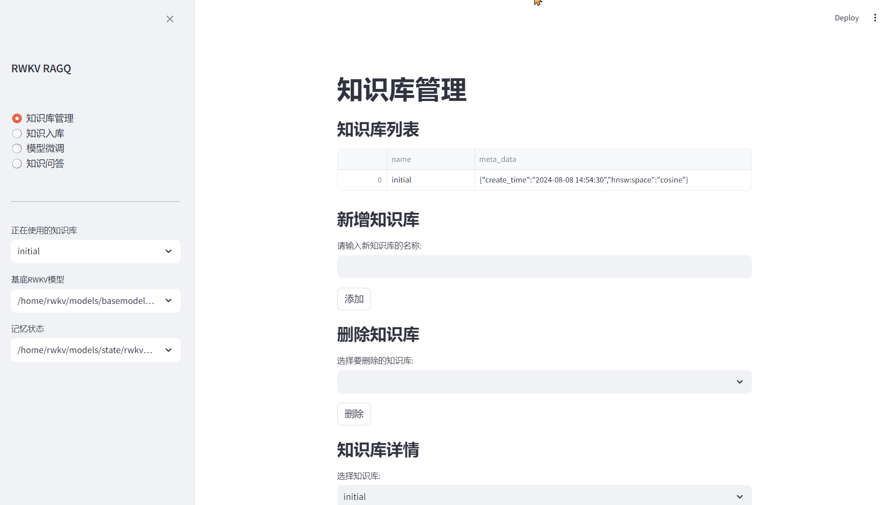
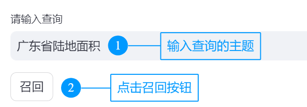
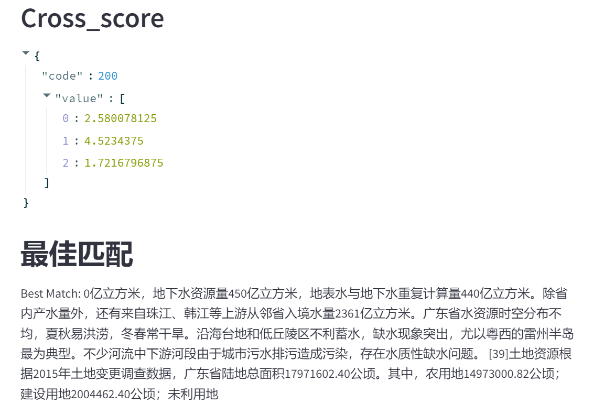
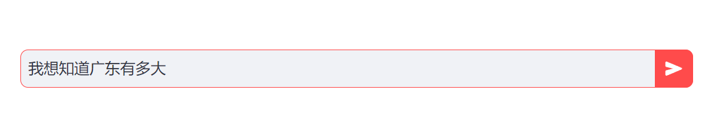

## 用户指南

### 知识库管理

知识库管理界面用于管理存储在向量数据库中的知识库，一个collection就是一个知识库，默认都会创建一个名为initial的知识库。支持对知识库进行新增、删除和查询知识库内容等操作。

> [!TIP]  
> 
> 由于Streamlit架构的限制，新增、删除知识库后，建议刷新 Web 页面同步最新改动。

---

### 知识入库

知识入库界面用于将文本内容**分块索引**到现有的知识库中，已入库的知识可以被检索，用于问答机器人或其他下游服务。

RWKV-RAG 支持三种不同的知识入库方法，这些方法支持解析 TXT、PDF和Excel 三种文件格式：

- **手动输入：** 在输入框中手动输入或粘贴文本内容，系统会按行对文本进行Chunking（**分块**）
- **从本地计算机上传到服务器端：** 从你的本地客户端往服务器端上传一个文件，系统会按照固定长度和块重叠字符数对文件进行Chunking（**分块**）
- **从服务器端本地上传：** 如果你需要将服务器中**某个文件**或者**某个目录**下所有文件的内容加入知识库，填写文件或者目录的路径，系统会按照固定长度和块重叠字符数对文件进行Chunking（**分块**）

> [!WARNING]  
> 
> 支持文本格式或图片格式的PDF文件入库，但是需要提前安装**tesseract**，并需要安装中文语言包(**chi_sim**)

> [!TIP]  
> 
> RWKV-RAG 也支持从互联网上搜索知识，并将搜索到的知识文本以 TXT 格式保存到**服务器端的指定目录**。
>
> **联网搜索得到的 txt 文本文件仍然需要进行知识入库，才能加入现有知识库中。**

---

### 知识问答机器人

RWKV-RAG 系统提供基于知识库的问答机器人（RWKV-RAG-CHAT）。用户可以从现有的知识库中检索特定主题的知识，然后利用提取到的知识与模型进行聊天，以增强模型的回答效果。

RWKV-RAG-CHAT 的工作流程如下：

1. **输入查询内容，点击 “召回” 按钮**
   
  

2. **RWKV-RAG 从知识库中提取最相关的知识（文本块）**
   
  

3. **rerank 模型对提取出来的文本块进行匹配度打分，选出最佳匹配知识**
   
   

4. **在底部输入框中输入问题并点击 “发送” 按钮，与模型聊天**

  
